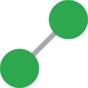

# TouchGraphs



---

## Introduction

TouchGraphs is a Kotlin library that provides graph theory algorithms that can be applied on any collection of objects.

---

## Download

### Gradle (Traditional)

In `build.gradle` :

```kt
allprojects {
	repositories {
		/*...*/
		maven { url 'https://jitpack.io' }
	}
}
```

```kt
dependencies {
  implementation 'com.github.MaxBuster380:TouchGraphs:1.0.0'
}
```

### Gradle (Kotlin)

In `build.gradle` :

```kt
allprojects {
  repositories {
    /*...*/
    maven("https://jitpack.io")
  }
}
```

```kt
dependencies {
  implementation("com.github.MaxBuster380:TouchGraphs:1.0.0")
}
```

### Maven

In `pom.xml` :

```xml
<repositories>
	<repository>
	    <id>jitpack.io</id>
	    <url>https://jitpack.io</url>
	</repository>
</repositories>
```

```xml
<dependency>
    <groupId>com.github.MaxBuster380</groupId>
    <artifactId>TouchGraphs</artifactId>
  <version>1.0.0</version>
</dependency>
```

---

## Template

```kt
fun main() {

  val words = listOf(
    "apple", "rice", "egg", "pineapple", "gummy", "cocoa", "pepper", "cup"
  )

  // Creates a graph where two words are linked if the first's last letter is the second's first
  val wordsGraph = graphOf<String> { tail ->
    words.filter { head ->
      tail.last() == head.first()
    }.toSet()
  }

  val start = "cocoa"
  val end = "gummy"

  val path = wordsGraph.findPath(start, end)

  // Prints "Path from cocoa to gummy : [cocoa, apple, egg, gummy]"
  println("Path from $start to $end : $path")
}
```

### Operations & Algorithms

Many well-known algorithms are implemented in `Graph` :

- `breadthFirstSearch`, gives an iterator to browse nodes from closest to a given origin node to furthest. Note that
  this does not mean iterating on every node of the graph.
- `depthFirstSearch`, similar to `breadthFirstSearch` but the next node to iterate on is one furthest away.
- `connectedComponents`, finds the connected sets of nodes in a graph.
- `findPath`, runs the **A\* algorithm** to find a path between two nodes.
- `shortestPath`, runs **Dijkstra's algorithm** to find the shortest path between two nodes.
- `stronglyConnectedComponents`, runs **Tarjan's algorithm** to find all groups of strongly connected nodes.
- `maximalCliques`, runs the **Bron-Kerbosch algorithm** to find all maximal cliques.
