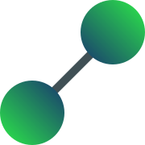

# TouchGraphs



- I - Introduction
- II - Download
- III - Documentation
- IV - About

---

### I - Introduction

TouchGraphs is a Kotlin library that allows any system of related
objects to be treated as a graph and run graph theory algorithms on it.

---

### II - Download

__Gradle__

In `build.gradle` :

```gradle
allprojects {
	repositories {
		/*...*/
		maven { url 'https://jitpack.io' }
	}
}
```

```gradle
dependencies {
    implementation 'com.github.MaxBuster380:TouchGraphs:alpha-1.0.0'
}
```

__Maven__

In `pom.xml` :

```xml
<repositories>
	<repository>
	    <id>jitpack.io</id>
	    <url>https://jitpack.io</url>
	</repository>
</repositories>
```

```xml
<dependency>
    <groupId>com.github.MaxBuster380</groupId>
    <artifactId>TouchGraphs</artifactId>
    <version>alpha-1.0.0</version>
</dependency>
```

---

### III - Documentation

#### Create a graph

The main protagonist of the library is the `Graph` class.

```kt
abstract class Graph<Node> {

    abstract fun successors(tail: Node): Set<Node>

    open fun areJoined(tail: Node, head: Node): Boolean

    open fun edgeWeight(tail: Node, head: Node): Double = 1.0
}
```

This is the class you'll have to inherit from to turn any system into a graph.
To define your graph, you have a few functions you can edit :

- The `successors` method, which should return the set of successor nodes for a given node. This is how you define your
  graph, so it must be overriden.
- The `areJoined` method, which returns true only when a given head node is a successor of a given tail node. While not
  necessary, it is recommended to override this method.
- The `edgeWeight` method, which allows edges to each have a numerical value, called a weight. By default, this value is
  1 for all existing edges.

Armed with this knowledge, let's make our first graph !

You are given a list of words, and you want to connect them if one's last letter matches another's first. (e.g. the
edge ("node", "edge") exists because "node" ends with 'e' and "edge" starts with 'e'.)

The answer below creates the graph as an object singleton.

```kt
fun main() {

    val words = listOf(
        "apple", "rice", "egg", "pineapple", "gummy", "cocoa", "pepper", "cup"
    )

    val wordsGraph = object : Graph<String>() {

        override fun successors(tail: String): Set<String> {
            return words.filter {
                tail.last() == it.first()
            }.toSet()
        }

        // Override not necessary but recommended.
        override fun areJoined(tail: String, head: String): Boolean {
            return tail.last() == head.first()
        }
    }

  // ...
}
```

And there you go ! You now have access to all graph theory algorithms to apply on your system !
Let's try to find the shortest path from "apple" to "gummy"

```kt
// ...
val path = wordsGraph.shortestPath("apple", "gummy")
println("Shortest path from \"apple\" to \"gummy\" : $path")
```

```
Shortest path from "apple" to "gummy" : [apple, egg, gummy]
```

#### Operations & Algorithms

Many well-known algorithms are implemented in `Graph` :

- `breadthFirstSearch`, gives an iterator to browse nodes from closest to a given origin node to furthest. Note that
  this does not mean iterating on every node of the graph.
- `depthFirstSearch`, similar to `breadthFirstSearch` but the next node to iterate on is one further away
- `findPath`,
- `shortestPath`,
- `shortestPaths`,
- `shortestPathMapping`,
- `stronglyConnectedComponents`, 